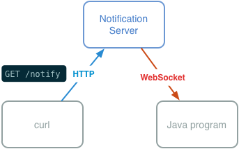

# Push notifications with Java and Node.js

Vojtech Rinik

## Intro

Node.js is an environment that lets you run JavaScript on the server side. We're gonna write a very simple program in Node.js that will run a web server, and a socket server, and forward all HTTP requests to all the connected clients through WebSocket.

The figure shows what you will be doing in this tutorial: You will start by writing the Notification Server. Then you'll write Java program that will connect to it, and then you'll test everything by making HTTP request from `curl` utility.

If it sounds complicated, don't worry, it shouldn't take more than 100 lines in total.

Note: It is recommended to use Unix-based environment to follow this guide. If you decide to use Windows, and you struggle with something, please consider running Ubuntu in a virtual machine.

## Installing Node.js and required modules

Node.js is easy to install, just head to [Node.js website](http://nodejs.org/), and follow the instructions.

Now we're gonna need some modules. Modules are little packages that are used in the world of Node.js to distribute libraries.

Installing modules is as simple as copying their source code into `./node_modules`, if the current directory is the working directory.

It's easier to install [npm](http://npmjs.org/), which is the Node Package Manager. Then you can simply type: `npm install module_name`. Do this in the working directory of your project.

Install the following modules:

- `websocket-server`. If you're not using npm, download the source code from the [GitHub repo](https://github.com/miksago/node-websocket-server).

## Creating simple WebSocket server in Node.js

Create a new file, call it `server.js` and insert the following code:

    var ws = require("websocket-server");

    var server = ws.createServer();

    server.addListener("connection", function(connection){
      console.log('Client connected');
      connection.addListener("message", function(msg){
        console.log('Received message: ', msg);
        connection.send('Echo: ' + msg);
      });
    });

    server.listen(5000);

On line 1, we "require" the `websocket-server` module. This is similar to namespaces and other concepts from other languages, but here's an important thing: When you include something, it doesn't alter your global namespace, you must assign it to a variable. Once you've done it, you can use it, as you can see on line three. `ws` is an object, and we're calling function `createServer` on it.

By the way, the "something" can be anything -- a function, an object, even a string. 

Let's move to line 3: We use `createServer` to create a new WebSocket server. We assign the result of this function call to variable `server`.

On the line 5, we add a listener to the server. This is event-driven programming: We tell the server, "server, when somebody connects, call this function." As function we pass in a new anonymous function. [1]

Also, the function has an argument: `connection`. When somebody connects, this function will be called with argument `connection`, and we'll be able to work with that client.

On line 6, we log out a message that client connected, and we listen for another event: `message`. This event will be called when the client sends us a message. Also, it the message will be sent as argument to the function.

As you can see, we add this listener to the `connection` object. We ask server to execute our function 1 when somebody connects. The function 1 will take the connected client, and ask it to execute function 2 when they send us a message. When that happens, we send back the same message with "Echo: " at the beginning.

On the line 13 we start the server on port 5000. 

## Creating the Java client and connecting to the server

Create a new directory for the client application. Create a new file, `Client.java`. Now clone or copy the [java-websocket-client repository](https://github.com/stellaeof/java-websocket-client). Compile the library by going into its directory and running the command `ant`. (Or you can use one of them fancy IDEs if that's your thing.)

Try compiling simple program to make sure everything works:

    import net.rcode.wsclient.*;

    class Client {
      public static void main(String args[]) {
        System.out.println("Hello World");
      }
    }

Compile it against the jar file previous step created, and run it:

    javac -cp java-websocket-client/build/dist/java-websocket-client.jar Client.java
    java -cp .:java-websocket-client/build/dist/java-websocket-client.jar Client

We can now proceed to connecting to the local server. Replace your `Client.java` with the following code:

    import net.rcode.wsclient.*;
    import net.rcode.wsclient.WebSocket.Event;

    class Client {
      public static void main(String args[]) throws InterruptedException {
        WebSocket ws = new WebSocket("ws://127.0.0.1:5000/");

        ws.addListener(new WebSocket.EventListener() {
          @Override
          public void handleEvent(Event event) {
            if (event.getType() == WebSocket.EVENT_MESSAGE) {
              Message msg       = event.getMessage();
              CharSequence text = msg.getMessageText();
              System.out.println("Received message: " + text);
            } else if (event.getType() == WebSocket.EVENT_ERROR) {
              System.out.println("Error: " + event.getError());
            }
          }
        });

        ws.start();
        ws.send("Hello!");
        ws.send("World!");
        Thread.sleep(1000);
        ws.close();
        ws.waitForReadyState(WebSocket.CLOSED);
        System.out.println("Closed.  ReadyState=" + ws.getReadyState());
      }
    }

This is all the code you need to communicate with the server. 

## References

1. http://stackoverflow.com/questions/1140089/how-does-an-anonymous-function-in-javascript-work